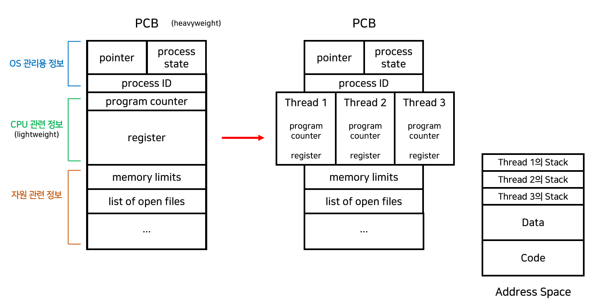
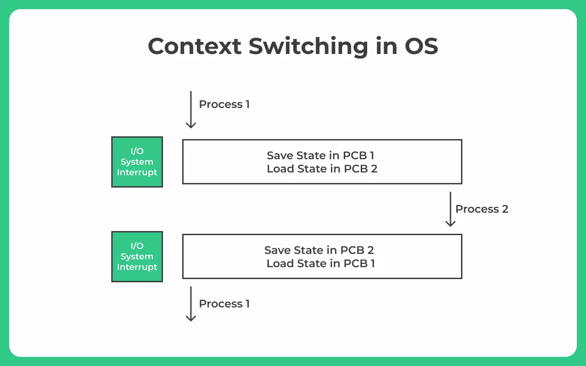

## Context Switching

- CPU는 한번에 하나의 프로세스만 처리할 수 있다.
- 여러 프로세스를 처리하는 과정에ㅔ서 현재 진행중인 Task(프로세스, 스레드)의 상태를 PCB에 저장하고 다음에 진행할 Task의 상태값을 읽어 적용하는 과정을 말한다.
- 다시말해 다른 프로세스에게 CPU를 할당해 작업을 수행하는 과정을 말하낟.
- 과정
  - Task 의 대부분의 정보는 register 에 저장되고 PCB로 관리된다.
  - 현재 실행하고 있는 Task 의 PCB 정보를 저장한다.
  - 다음 실행할 Task의 PCB 정보를 읽어 register에 적재하고 CPU가 이전에 진행했던 과정을 연속적으로 수행할 수 있다.
- Context Switching 은 많은 비용이 소모된다.
  - cache의 초기화
  - memory의 mappiing 초기화
  - 커널은 항상 실행되어야 한다.