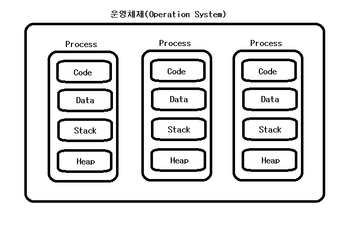
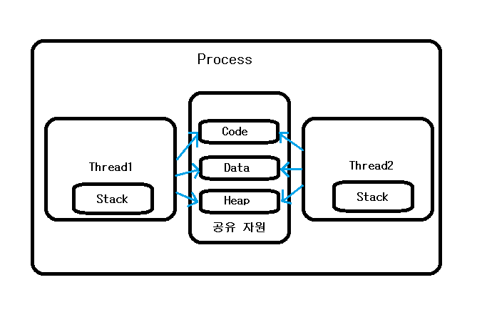
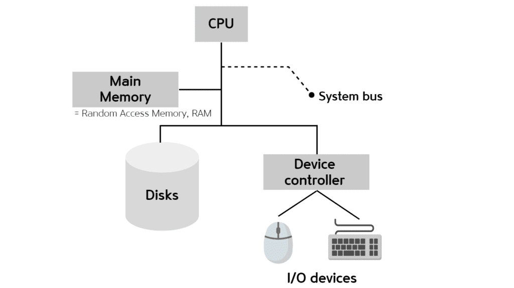
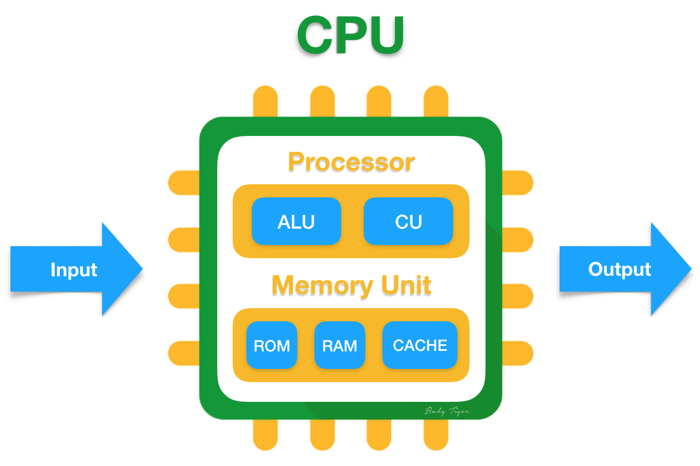
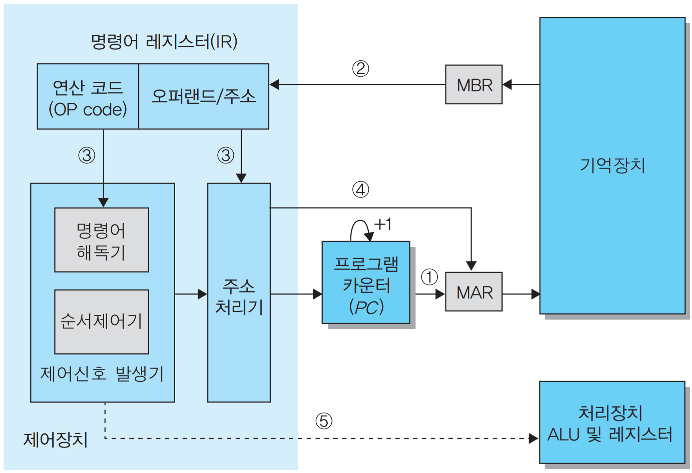

## Multi Process, 멀티 프로세스
- 하나의 응용프로그램을 여러 개의 프로세스로 구성하여 각 프로세스가 하나의 작업을 처리하도록 하는 것
* 장점
    - 여러개의 자식 프로세스 중 하나에 문제가 발생하면 그것이 죽는 것 이상으로 다른 영향이 확산되지 않는다. 왜냐하면 프로세스는 각각 독립적이기 때문이다.
* 단점
    - Context Switching 에서의 오버 헤드 
      -  프로세스는 각 독립된 메모리 영역을 할당 받았ㄲ기 때문에 공유하는 메모리가 없다. 따라서 캐시 메모리 포기화 등의 무거운 작업이 진행되고 많은 시간이 소모되는 등의 오버헤드가 발생할 수 있다.
    - 프로세스 간 통신 기법 IPC
      - 프로세스는 각 독립된 메모리 영역을 할당받았기 때문에 프로세스들 사이에서 변수나 자료구조를 공유할 수 없다. 따라서  IPC 라는 통신 기법을 사용하는데 이는 복잡하고 어렵다.  

## Multi Thread, 멀티스레드
- 하나의 응용 프로그램을 여러 개의 스레드로 구성하고 각 스레드가 하나의 작업을 처리하도록 하는 것
- 윈도우, 리눅스 등 많은  OS들이 멀티 프로세싱을 지원하고 있지만, 멀티 스레딩을 기본으로 하고 있다.
- 웹 서버는 대표적인 멀티 스레드 응용 프로그램이다.
* 장점
   - 메모리 공간과 시스템 자원 소모가 줄어들게 된다.
   - 스레드간 통신 시 , 전역 변수의 공간 또는 동적으로 할당된 공간의 Heap영역을 이용해 데이터를 주고 받으므로 통신 방법이 간단하다.
   - Context Switching시 캐시 메모리를 비울 필요가 없기 때문에 비용이 적고 더 빠르다.
   - 따라서 시스템의 처리량이 향상되고 자원 소모가 줄어들며 자연스럽게 프로그램의 응답 시간이 단축된다.
* 단점
  - 서로 다른 스레드가 Data, Heap 영역 등을 공유하기 때문에 어떤 스레드가 다른 스레드에서 사용중인 변수나 자료구조에 접근하여 엉뚱한 값을 가져오거나 수정할 수 있다. 즉 자원 공유의 문제가 발생한다. (동기화)
  - 하나의 스레드에 문제가 생기면 전체 프로세스가 영향을 받는다.
  - 주의 깊은 설계가 필요하고 디버깅이 까다롭다.

* 참고
  - CPU의 구조
  
  
  
  

 

### 멀티 프로세스 vs 멀티 스레드
- 멀티 스레드는 멀티 프로세스보다 적은 메모리 공간을 차지하고 Context Switching 이 빠르다는 장점이 있지만, 오류허 인해 하나의 스레드가 종료되면 전체 스레드가 종료될 수 있다는 점과 동기화 문제를 가지고 있다.
- 멀티 프로세스 는 하나의 프로세스가 쭉더라도 다른 프로세스에는 영향을 끼치지 않고 정상적으로 수행된다는 장점이 있다.
-  이 두가지는 동시에 여러 작업을 수행한다는ㄴ 점에서 같지만 적용해야 하는 시스템에 따라 적합과 부적합이 구분된다. 따라서 대상 시스템의 특징에 따라 적합한  동작 방식을 선택하고 적용해야 한다.

 

### 자주 나오는 질문
Q. 스택을 스레드마다 독립적으로 할당하는 이유는 뭘까 ? 
- 스택은 함수 호출시 전달되는 인자 ,복귀 주소값 및 함수 내에서 선언하는 변수 등을 저장하기 위해 사용되는 메모리 공간
- 스택 메모리 공간이 독립적이라는 것은 독립적인 함수 호출이 가능함을 의미하고 이는 독립적인 실행 흐름이 추가된다는 것이다.
- 스레드의 정의에 따라 독힙적인 실행 흐름을 추가하기 위한 푀소 조건으로 독립된 스택을 할당하는 것이다.

Q. PC Register 를 스레드마다 독립적으로 할당하는 이유는 뭘까 ?
- PC 값은 스레드가 명령어의 어디까지 수행했는지를 나타내게 된다. 스레드는 CPU를 할당받았다가 스케줄러에 의해 다시 선점당한다.
- 그렇기 때문에 명령어가 연속적으로 수행되지 못하고 어느 부분까지 수행했는지 기억할 필요가 있다. 
- 따라서  PC 레지스터를 독립적으로 할당한다.

Q. 멀티 프로세스 대신 멀티 스레드를 사용하는 이유는 ?

