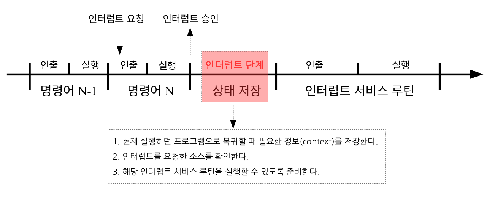
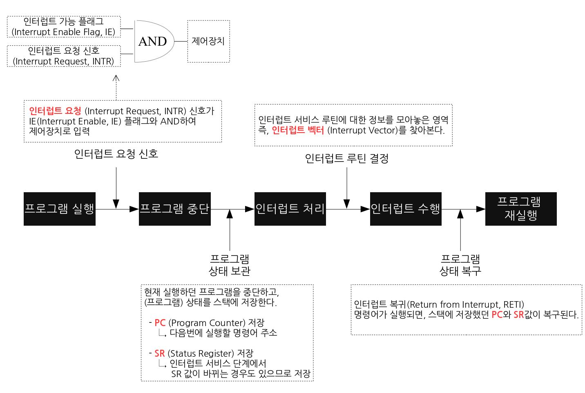

# 인터럽트 Interrupt
CPU가 프로그래램을 실행하고 있을때, 입출력 하드웨어 드으이 장치나 예외상황이 발생하여 처리가 필요할 경우에 마이크로프로세서에게 알려 처리할 수 있도록 하는 것을 말한다.
* 인터럽트 서비스 루틴(=인터럽트 핸들러) 가 가장 중요한 개념
* 하드웨어에서의 인터럽트와 소프트웨어에서의 인터럽트가 있다.

- 인터럽트의 요청이 있다고 바로 실행되는 것은 아니고 명령어 N의 인출과 실행단계를 모두 마쳐야 그 다음에 승인을 통해 인터럽트 단계를 실행한다.
- 인터럽트 단계란
  1. 현재 실행하던 프로그램으로 복귀할 때 필요한 정보인 context를 저장한다.
  2. 인터럽트를 요청한 소스를 확인한다.
  3. 해당 인터럽트 서비스 루틴을 실행할 수 있도록 준비한다.

### 하드웨어에서의 인터럽트
하드웨어가 발생시키는 인터럽트로 CPU 가 아닌 다른 하드웨어 장치가 CPU에 어떤 사실을 알려주거나 CPU 서비스를 요청해야할 경우 발생시킨다.

### 소프트웨어에서의 인터렵트 
소프르퉤어가 발생시키는 인터럽트이다.
소프트웨어(사용자 프로그램)가 스스로 인터럽트 라인을 셋팅한다.

< 종류 >  
1) 예외상황(Exception)
    - 프로그램이 허용되지 않은 연산을 수행하려고 할때 자동적으로 발생한다.
    -  OS 는 예외상황이 발생했을때 CPU 제어권을 획득해 조취한다.
      - ex) 0으로 나누는 연산, 자신의 주소 공간을 넘어서는 메모리 참조 등
      - 예외상황에 대한 처리 루친을 자신의 코드 영역에 가지고 있는다.
2) 시스템 콜(System call)
    - 사용자 프로세스가 운영체제의 서비스를 요청하기 위해 커널의 함수를 호출하는 것이다.
    - 사용자 프로세스가 직접 특권 명령을 수행할 수 없으므로 특권 명령을 수행하려 할 때, 시스템 콜을 사용한다.
   

< 발생과정 >

process A 실행 중 디스크에서 어떤 데이터를 읽어오라는 명령을 받았다고 가정해보자.

- process A는 system call을 통해 인터럽트를 발생시킨다.
- CPU는 현재 진행 중인 기계어 코드를 완료한다.
- 현재까지 수행중이었던 상태를 해당 process의 PCB(Process Control Block)에 저장한다. (수행중이던 MEMORY주소, 레지스터 값, 하드웨어 상태 등...)
- PC(Program Counter, IP)에 다음에 실행할 명령의 주소를 저장한다.
- 인터럽트 벡터를 읽고 ISR 주소값을 얻어 ISR(Interrupt Service Routine)로 점프하여 루틴을 실행한다.
- 해당 코드를 실행한다.
- 해당 일을 다 처리하면, 대피시킨 레지스터를 복원한다.
- ISR의 끝에 IRET 명령어에 의해 인터럽트가 해제 된다.
- IRET 명령어가 실행되면, 대피시킨 PC 값을 복원하여 이전 실행 위치로 복원한다

< 처리 과정 >  
A 프로그램이 CPU를 할당받고 명령을 수행하고 있는데 인터럽트가 발생하면 A는 현재 수행중인 명령의 위치를 저장해놓는다. 
그 후, 운영체제 내부 코드인 인터럽트 처리루틴으로 넘어가서 인터럽트 처리를 하고 다시 돌아와  A의 이전 작업 지점부터 수행을 계속 이어나가게 된다.

진행 중이던 A 프로세스의 정보는 프로세스 제어 블록인 PCB에 저장한다. 그리고 인터럽트 처리를 모두 마치면 프로그램 A의  PCB에 저장된 주소를 복원시켜 원래 수행하던 일을 재개하게 된다.

* 인터럽트 핸들러(Interrupt Handler)
    - 실제 인터럽트를 처리하기 윟란 루틴으로 인터럽트 서비스 루틴
    - OS 코드 부분에는 각종 인터럽트 별로 처리해야할 내용이 이미 프로그램되어있고 이 부분을 인터럽트 서비스 루틴, 또는 인터럽트 핸들러라고 한다.

* 인터럽트 벡터(Vector)
  - 여러가지 인터럽트에 대해 해당 인터럽트 발생시 처리해야 할 루틴의 주소를 보관하고 있는 테이블
  - 일종의 함수를 가리키는 포인터
  - 아키텍처의 구조에 따라 인터럽트 벡터를 서로 다르게 저장한다.
  - 인터럽트 번호는 예외상황 인터럽트를 제외하고 운영체제가 결정한다.
  
ex) 리눅스에서 인터럽트 번호는 아래와 같다.

    0 ~ 31 : 예외상황 인터럽트
    32 ~ 47 :  하드웨어 인터럽트
    128 : 시스템 콜

예를 들어 입출력 관련 인터럽트가 발생한 경우, CPU는 인터럽트 라인을 통해 발생한 인터럽트를 확인한다. 
인터럽트 벡터를 통해 해당 인터럽트 발생시 처리해야할 수틴의 메모리 주소를 알아낸다. 
주소를 통해 실제 수행되어야 할 코드가 담겨있는 루틴을 찾아가 상황에 맞는 처리를 진행한다.

+) 
### 명령어의 종류
CPU가 수행하는 명령에는 일반 명령과 특권 명령이 있다.
- 일반 명령은 메모리에서 자료를 읽어오고, CPU에서 계산을 하는 등의 명령이고 모든 프로그램이 수행할 수 있는 명령이다.
- 특권 명령은 보안이 필요한 명령으로 입출력 장치, 타이머 등의 장치를 접근하는 명령이다. 특권 명령은 항상 운영체제만이 수행할 수 있다.

### kernel mode vs user mode
운영체제는 하드웨어적인 보안을 유지하기 위해 기본적으로 두가지 operation을 지원한다. kernel mode는 운영체제가 CPU의 제어권을 가지고 명령을 수행하는 모드로 일반 명령과 특권 명령 모두 수행할 수 있다.
하지만 user mode는 일반 사용자 프로그램이 CPU제어권을 가지고 명령을 수행하는 모드이기 때문에 일반 명령만을 수행할 수 있다.

