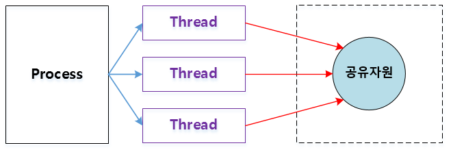
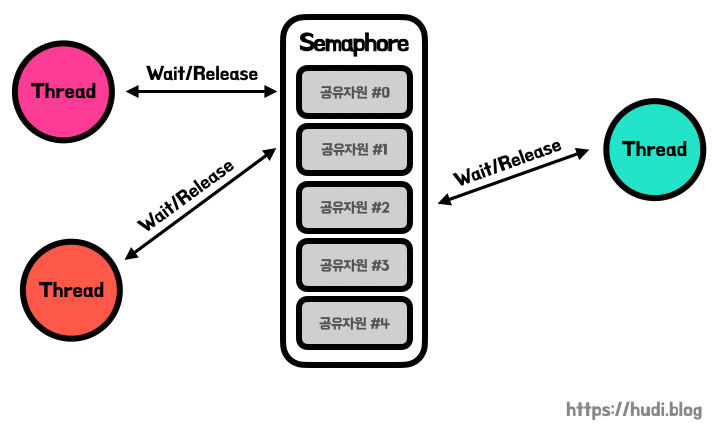
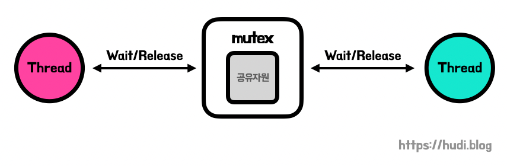
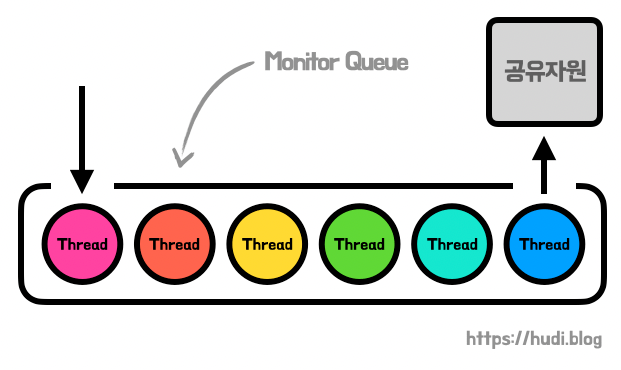
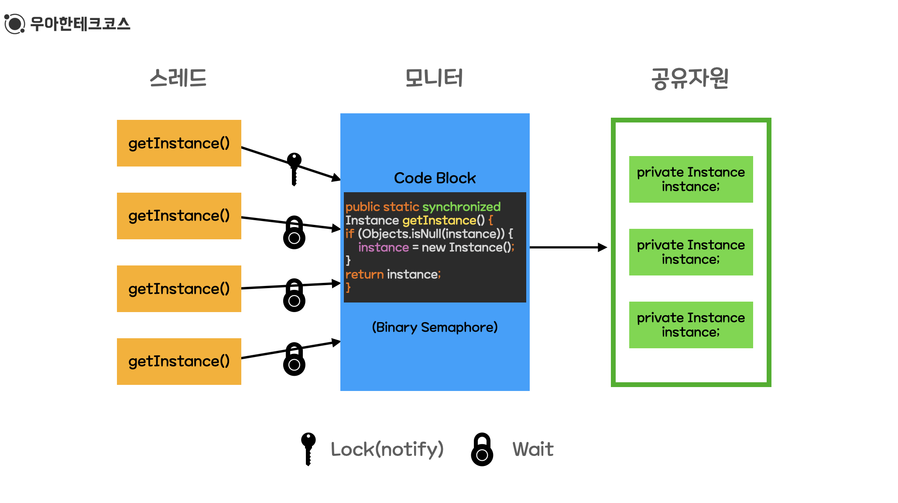

# 동기화 문제
## 동기화 
한정된 시스템 자원에 여러 스레드가 동시에 접근해서 사용하면 문제가 발생할 수 있는다. 이 문제를 방지하기 위해 여러 스레드에게 하나의 자원에 대한 처리 권한을 주거나 순서를 조정하는 기법이다.

### 스레드의 동기화
1. 실행 순서의 동기화 : 스레드의 실행 순서를 정의하고 이 순서를 반드시 따르게 하는 것.
2. 메모리 접근에 대한 동기화 : 
   - 메모리 접근에 있어서 동시 접근을 막는 것
   - 실행의 순서가 중요한 것이 아니라 한 순간에 하나의 스레드만 해당 자원에 접근하도록 하는 것

### 동기화 기법
 1. 유저 모드의 동기화
    - 커널의 힘을 빌리지 않는 동기화 기법( 커널의 코드가 실행되지 않음)
    - 성능상의 이점은 있으나 기능상의 제한점이 존재
    -  임계 구역 기반의 동기화와 인터락 함수 기반의 동기화가 있다.
    
 2. 커널 모드의 동기화
    - 커널에서 제공하는 동기화 기능을 이용하는 방법
    - 커널 모드로의 변경이 필요하고 이는 성능 저하로 이어진다. 그러나 다양한 기능을 활용할 수 있다.
    - 세마포어, 뮤텍스, 모니터 등이 있다.

### 동기화 프로그래밍의 가장 큰 이슈 : 공유자원의 관리

- 공유자원을 안전하게 관리하기 위해서는 상호배제르 달성하는 기법이 필요하다.
- 뮤텍스와 세마포어는 이를 위해 고안된 기법이다. 이 둘은 서로 다른 방식으로 상호배제를 달성한다.

  
* 유저모드의 동기화 
    + 임계구역 기반의 동기화
        - 열쇠를 얻은 프로세스만이 임계구역에 들어갈 수 있다. 
        - 즉 한번에 하나의 스레드만이 접근 가능하다
        - 임계구역 진입을 위해 크리티컬 섹션 오브젝트를 얻는다.
        - 다른 스레드가 열쇠를 가지고 있을 시에는 반환할 때까지 블로킹 된다.
        - 열쇠가 반환되면 블로킹 상태에서 빠져나와 열쇠를 얻고 임계 구역에 접근한다.

    + 인터락 함수 기반의 동기화
        - 함수 내부적으로 한 순간에 하나의 스레드에 의해서만 실행되도록 동기화된다.
        - 임계 구역 기반의 동기화도 내부적으로 인터학 함수를 기반으로 구현된다.
        - 유저모드 기반으로 동작해서 속도가 빠르다.
  
      
#### 임계영역이란?
    - 둘 이상의 스레드가 동시에 접근해서는 아나되는 공윺자원을 접근하는 코드의 일부를 말한다.
    - 임계영역에서 동기화를 진행하지 목하면 치명적인 문제가 발생한다.
    - 따라서 임계구역 문제를 해결하기 위해서 3가지 필수 조건이 있다.
        1. 상호배체 Mututal exlusion : 프로세스 P1 이 공유자원을 접근하는 임계 구역 코드를 수행하고 있으면 다른 프로세스들은 공유 자원을 접근하는 임계 구역 코드를 수행할 수 없다.
            즉, 한 순간에 하나의 스레드만이 실행될 수 잇따.
        2. 진행 Progress : 임계 구역에서 실행 중인 프로세스가 없고 별도의 동작이 없는 프로세스들만 임계 구역 진입 후보로서 참여될 수 있다.
        3. 한정된 대기 Bounded Waiting : P1 프로세스가 임계 구역에 진입 신청 한 후부터 받아들여질때까지 다른 프로세스들이 임계 구역에 진입하는 횟수는제한이 있어야 한다.
    
* 커널 모드의 동기화
   + 세마포어 Semapohore 

        - 공유된 자원의 데이터를 여러 프로세스, 스레드가 접근하는 것을 막는 것이다.
        - 동시에 접근할 수 있는 '허용 가능한 갯수'를 가지고 있는  Counter
        - 공유 자원에 접근할 수 있는 스레드 혹은 프로세스의 수를 나타내는 값
        - 공통으로 관리하는 하나의 값
        - 세마포어 Counter의 갯수에 따라 다음과 같이 나뉜다. 
        - 1개 : Binary Semaphore(뮤텍스와 같다)]
        - 2개 이상 : Counting Semaphore
        - 세마포어는 소유할 수 없다.
        - 세마포어를 소유하지 않은 스레드가 세마포어를 해제할 수 있는 문제가 발생한다.
        - ex) 예로 주차장을 생각한다. 주차장은 여러 주차칸이 있고 입구에는 현재 주차 공간이 남은 갯수를 보여주는 전광판이 있다.
        - 주차를 하려면 입구에서 빈 자리를 확인하고 하나 이상이라면  입구에 들어가면서 전광판의 갯수가 하나 줄어들 수 있따. 나올때 전광판이 하나 더해주는 것이다.
        - 모든 주차칸에 ㅔ차가 들어갔을 경우 빈칸의 갯수는 0이 되며 이때 주차장에 뜰어가려는 차가 있다면 빈칸의 갯수가 1로 바뀔때까지 기다려야 한다. 이용을 마친 차들은 나오면서 빈칸의 갯수를 1씩 더한다. 그리고 기다리던 차들은 들어가면서 1을 뺀다.
        - 여기서 주차칸을 '공유자원'에 비유했고 주차가능 빈칸의 개수를 ' 현재 공유자원에 접근할 수 있는 스레드, 프로세스의 갯수'를 나타냈다. 주차장을 이용하려는 차들은 '프로세스 혹은 스레드'이다.
        - ex) 예로 화장실 문제도 많이 나온다.
        
      
   * 뮤텍스 Mutal Exclusion
  
       - 공유된 자원의 데이터를 여러 프로세스, 스레드가 접근하는 것을 막는 것이다.
       - 임계 구역을 가진 스레드들의 Running Time이 서로 겹치지 않게 각각 단독으로 실행되게 하는 기술이다.
       - 뮤텍스 객체를 두 스레드가 동시에 사용할 수 없다.
       - 일종의 Locking 매커니즘으로 공유자원에 대한 접근을 조율하기 위해 locking, unlocking을 사용한다.
       - Lock에 대한 소유권이 있으며 Lock을 가지고 있을 경우에만 굥유자원에 접근할 수 있고 Lock을 가진 사람만 반납할 수 있다.
       - 뮤텍스는 무조건 1개의 열쇠만 가질 수 있다. 
       - ex) 예로 화장실이 하나인 음식점을 생각한다. 음식점엔 화장실이 하나 있고 열쇠를 가진 사람만이 화장실에 갈 수 있다.
       다음 사람이 화장실에 가기 위해서는 앞사람이 열쇠를 반납해야 한다. 키는 카운터에 있다. 화장실이 가고 싶은 사람들은 카운터에서 키를 앞사람이 반납할때까지 기다렸다가 키를 받으면 갈 수 있다.
       - 화장실을 이용하는 사람이 '프록세스 혹은 스레드'이고 화장실은 '공유자원'에 속한다. 또한 화장실 키는 '공유자원에 접근하기 위해 필요한 어떤 오브젝트'이다.
       - 뮤텍스는 여기서 Key에 해당하는 어떤 오브젝트가 있으며 이 오브젝트를 소유한 프로세스나 스레드만이 공유자원에 접근할 수 있다. 
        
        
  * 모니터 Monitor 
 
       - 공유자원에 점유중인 프로세스는 Lock을 가지고 있다.
       - 공유자원을 점유중인 프로세스가 있는 상황에서 다른 프로세스가 공유자원에 접근하려 하면 외부 모니터 준비 큐에서 진입을 wait 한다.
       - Monitor는 Semaphore처럼 signal연산을 보낸느 것이 아니라 조건 변수를 사용하여 특정 조건에 대해 대기 큐에 signal을 보내 작업을 시작한다.
       - Mutex(Lock) 와 Condition Variables 를 가지고 있는 Synchronization 매커니즘이다.
       - Condition Variable 이 있는데, 이를 통해 wait(), notify () 메서드가 구현되어 있다.
       - Lock을 가진 스레드가 다른 스레드에 Lock을 넘겨준 이후에 대기해야 한다면, wait()를 사용하면 된다.
       - 대기 중인 모든 스레드를 깨우려면 notifyAll()을 통해 깨울 수 있는데 이 경우에는 하나의 스레드만 Lock 을 획득하고 나머지 스레드는 다시 대기 상태에 들어간다.
       - 모니터는 프로그래밍 언어 수준에서 제공된다.
       - 대표적으로 Java에서 제공한다.
       - 모니터는 이진 세마포어만 가능하다.
  
  
     

#### 세마포어와 뮤텍스의 차이는 ?
    - 세마포아는 뮤텍스가 될 수 있지만 뮤텍스는 세마포아가 될 수 없다.
    - 세마포어는 소유할 수 없으며 뮤텍스는 소유할 수 있고 소유주가 그 책임을 진다.
    - 뮤택스의 경우 뮤텍스를 소유하고 있는 스레드가 이 뮤텍스를 해제할 수 있다. 하지만 세마포어는 소유하지 않고 있는 다른 스레드가 세마포어를 해제할 수 있다.
    - 뮤텍스는 동기화 대상이 1개일 때 사용하고 세마포어는 동기화 대상이 여러 개일 때 사용한다.

#### 뮤텍스와 모니터의 차이는 ?
    - 뮤텍스는 다른 프로세스나 스레드 간에 동기화를 위해 사용한다.
    - 모니터는 하나의 프로세스내에서 다른 스레드 간에 동기화할 때 사용한다. 
    - 뮤텍스는 운영페제 커널에 의해 제공된다. 무겁고 느리다.
    - 모니터는 프레임워크나 라이브러리 그 자체에서 제공된다. 가볍고 빠르다.

#### 세마포어와 모니터의 차이는 ? 
    - 자바에서는 모니터를 모든 객체에게 기본적으로 제공하지만 C에서는 사용할 수 없다.
    - 세마포어는 카운터라는 변수값으로 프로그래머가 상호 배제나 정렬 의 목적으로 사용시 매번 값을 따로 지정해줘야 하는 등 조금 번거롭다.
    - 모니터는 이러한 일들이 캡슐화 되어 있어서 개발자는 카운터 값을 0 또는 1로 주어야 하는 고민을 할 필요없이 Synchronized, wait(), notify()  등의 키워드를 이용해 좀 더 편하게 동기화 할 수 있다.
