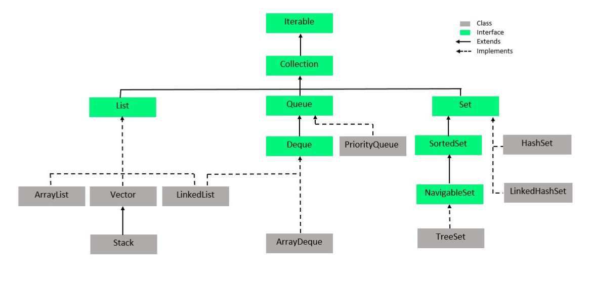
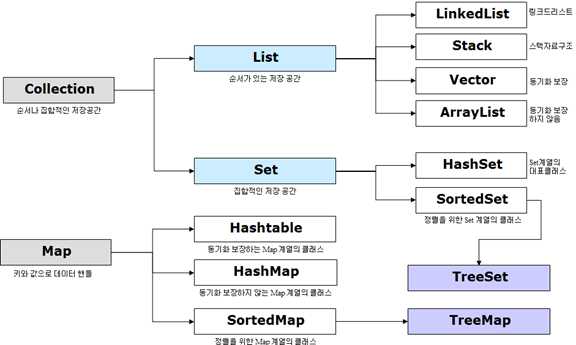
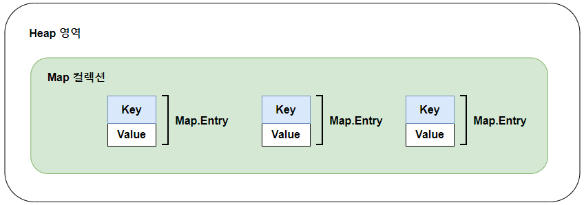

# 컬렉션 프레임워크
## 종류 
1. List
2. Set
3. Map

3가지가 있다.

몇 가지 인터페이스를 통해서 다양한 컬렉션 클래스를 이용할 수 있도록 설계되어 있다.
인터페이스 종류로는 List, Set, Map이 있는데 이 인터페이스로 사용가능한 컬렉션 객체의 종류는 다음과 같다.

List, Set은 겍체를 추가, 삭제, 검색하는 법에 있어 공통점이 있기 때문에 공통된 메소드만 따로 모아 Collection 인터페이스로 정의해두고 이것을 상속하고 있다.
Map은 키와 값을 하나의 쌍으로 묶어서 관리하는 구조로 List, Set 과는 사용 방법이 다르다.

## List 컬렉션
 - 객체를 인덱스로 관리
 - 인텍스로 객체를 검색, 삭제할 수 있는 기능을 제공
 - ArrayList, Vector, LinkedList 등이 있다.

### Array List 
    - List 에서 가장 많이 사용하는 컬렉션이다.
    - ArrayList에 객체를 추가하면 내부 배열에 객체가 저장된다.
    - 일반 배열과 차이점은 제한없이 객체를 추가할 수 있따는 것이다.
    - 객체는 번지에 저장된다. 
    - 객체의 번지를 저장한다.
    - 동일한 객체를 중복 저장이 가능하다, 동일한 번지 저장이 된다.
    - null 또한 저장가능
    - 객체 저장시 인덱스 0부터 차례대로 저장되고 특정 인덱스의 객체를 제거하면 바로 뒤부터 마지막 인덱스 까지 앞으로 1씩 당겨진다.
    - 따라서 빈번한 객체 삭제와 삽입이 일어나는 곳에서 Array List는 사용하지 않는게 좋다. 
    - 대신 Linked List가 훨씬 좋다.
- 배열과의 차이 : Capacity가 늘어남

  
- ArrayList의 객체 삭제

  
- Linked List와 Array List의 차이

   
### Vector
    - ArrayList와 동일한 내부 구조 
    - 차이점은 Vector는 동기화된 메소드로 구성되어 있기 때문에 멀티 스레드가 동시에 Vector()메소드를 실행할 수 없다는 것
    - 힌번에 하나의 스레드만 실행할 수 있어 경합이 발생하지 않는다.
    - 멀티 스레드 환경에서는 안전하게 객체를 추가 또는 삭제할 수 있다.

- Vector VS Array List

### Linked List
    - ArrayList와 사용방법은 동일하지만 내부 구조는 완전히 다르다.
    - ArrayList는 내부 배열에 객체를 저장하지만, LinkedList는 인접 객체를 체인처럼 연결해서 관리한다.
    - 중간에 객체를 제거할 경우 앞뒤 링크만 변경하면 된다.
    - 빈번한 객체의 삭제와 삽입이 일어난다.

## Set 컬렉션
 - List 컬렉션은 저장 순서를 유지하지만, Set 컬렉션은 저장 순서가 유지되지 않는다.
 - 객체를 중복해서 저장할 수 없고 하나의 null만 저장할 수 있다.
 - Set컬렉션은 수학의 집합에 비유된다.
 - 인텍스를 매개값으로 갖는 메소드가 없다.  

### HashSet
    - 가장 많이 사용된다.
    - HashSet은 동일한 객체는 중복 저장하지 않는다.
    - 동일한 객체란 동등 객체를 말한다.
    - HashSet 은 다른 객체라도 hashCode() 메소드의 리턴값이 같고 equals() 메소드가 true를 리턴하면 동일한 객체라 판단하고 중복 저장하지 않는다.
    - 인덱스로 객체를 검색해서 가져오는 메소드가 없다.
    - 대신 객체를 한 개씩 반복해서 가져와야하는데 for문을 이용하거나 iterator() 메소드로 iterator를 얻어 객체를 하나씩 가져오는 것이다.

## Map 컬렉션
 - Key, Value로 구성된 Entry 객체를 저장한다.
 - 키와 값은 모두 객체이다.
 - 키는 중복 저장이 안되지만 값은 중복 저장이 된다.

### HashMap
    - 키로 사용할 객체가 hashCode()메소드의 리턴값이 같고 equals()메소드가 true를 리턴할 경우, 동일 키로 보고 중복 저장을 허용하지 않는다.
    - HashMap보단 concurreuntHashMap을 사용하기

### Hashtable 
    - Hashtable은 HashMap과 동일한 내부 구조를 가지고 있다.
    - 차이점은 hashtable은 동기화 메소드로 구성되어 있어 멀티 스레드가 동시에 메소드들을 실행할 수 없다.
    - 따라서 멀티 스레드 환경에서도 안전하게 객체를 추가, 삭제할 수 있다.

### Properties
    - Hashtable의 자식 클래스 특징을 그대로 가지고 있다.
    - 키와 값을 String 타입으로 제한한 컬렉션이다.
    - 주로 확장자가 .properties 인 프로퍼티 파일을 읽을 떼 사용한다.
    - 클래스 파일들과 함께 저장되는 프로퍼티 파일
    - 따라서 클래스 파일을 기준으로 상대 경로를 이용해서 읽는 것이 편하다.

## 검색기능을 강화시킨 컬렉션
 - TreeSet(Set 컬렉션), TreeMap(Map 컬렉션)

### TreeSet
    - 이진트리를 기반으로 한 Set 컬렉션
    - 여러 개의 노드가 트리형태로 연결된 구조로 루트 노드로 불리는 하나의 노드에서 시작해 각 노드에 최대 2개의 노드를 연결할 수 있는 구조
    - 자동 정렬 : 부모노드의 객체와 비교해서 낮은 것은 왼쪽 자식 노드에 , 높은 것은 오른쪽 자식 노드에 저장
    - Red-Black Tree 라는 자료 구조를 사용해서 만들어짐

### TreeMap
    - 이진 트리를 기반으로 한 Map 컬렉션이다.
    - TreeSet과의 차이점은 키와 값이 저장된 Entry를 저장한다는 점이다.
    - TrreMap에 엔트리를 저장하면 키를 기준으로 자동정렬 되는데 부모 키 값과 비교해서 낮은 것은 왼쪽, 높은 것은 오른쪽 자식 노드에 Entry  객체를 저장한다.

### Comparable 과 Comparator
 - TreeSet, TreeMap에 저장되는 객체는 저장과 동시에 오름차순으로 정렬되는데 객체가 Comparable 인터페이스를 구현하고 있어야만 가능하다.
 - Integer, Double, String 타입은 모두 Comparable을 구현하고 있기 때문에 상관없지만, 사용자 정의 객체를 저장할때에는 반드시 Comparable 을 구현하고 있어야 한다.
 - Comparable 인터페이에는 comparaTo()메소드가 정의되어 있다.
 - 따라서 사용자 정의 클래스에서 이 메소드를 재정의해서 비교 결과를 정수 값으로 리턴해야 한다.

### LIFO 후입선출
    - 나중에 넣은 객체가 먼저 빠져나가는 구조
    - 컬렉션 프레임 워크로 stack 클래스를 제공 
    - 대표적인 예가 JVM 스택 메모리
    - ex) 스레드 풀의 작업 큐가 대표적이다.

### FIFO 선입선출
    - 먼저 넣은 객체가 먼저 빠져나가는 구조
    - FIFO 자료구조를 제공하는 Queue인터페이스를 제공
    - ex) Queue 인터페이스를 구현한 대표적예는 LinkedList이다.

## 동기화된 컬렉션
- 컬렉션 프레임워크의 대부분의 클래스들은 싱글 스레드 환경에서 사용할 수 있도록 설계되었다.
- 여러 스레드가 동시에 컬렉션에 접근한다면 의도하지 않게 요소가 변경될 수 있는 불안전한 상태가 된다.
- Vector 와 Hashtable 은 동기화된 메소드로 구성되어 있다. 멀티 스레드 환경에서 안전하게 요소를 처리할  수 있다.
- ArrayList 와 HashSet, HashMap을 멀ㄹ티 스레드 환경에서 사용하고 싶다면  동기화된 메소드로 래핑하는 Collections 의  synchronizedXXX() 메소드를 제공한다.
- ex) ArrayList : Collections.synchronizedList() 
- ex) HashSet : Collections.synchronizedSet()
- ex) HashMap : Collections.synchronizedMap()

## 수정할 수 없는 컬렉션
 - 생성시 저장된 요소를 변경하고 싶지 않을 때 유용하다.
 - List, Set, Map 인터페이스의 정적 메소드인 of()로 생성할 수 있다.
 - List, Map, Set 인터페이스의 정적 메소드인 copyOf()을 이용해 기존 컬렉션을 복사하여 수정할 수 없는 컬렉션을 만드는 것이다.
 - asList() : 배열로부터 수정할 수 없는 List 컬렉션을 만들수 있다. 

# 면접질문
## 배열 vs LinkedList ?

- Array (배열)은 정적인 길이를 제공한다.
- LinkedList는 추가, 삭제가 자유롭다.

## LinkedList VS ArrayList ?
- Java의 초기 버전인 1.0에서는 이러한 문제를 해소하기 위해 주로 Vector를 사용 하고는 했다. 하지만 Vector 역시 인스턴스 생성시에 capacity가 디폴트로 10개로 정해져 리스트의 개수가 capacity 이상이 되면 두배 씩 늘려 나아가는 전략을 택하고 있다.
  다수의 Thread에 대한 접근에 동기화를 보장하는 등 성능 이슈로 인해 Java 1.2 이후 부터는 호환성을 위해 제공하는 정도이며 List 인터페이스를 구현한 리스트로 대체하여 사용하고 있다.
- ArrayList는 동기화가 제공되지 않는다. 
- ArrayList는 데이터의 검색에 유리하며 추가, 삭제에는 성능을 고려해야 한다.
- LinkedList는 데이터를 저장하는 각 노드가 이전 노드와 다음 노드의 상태만 알고 있다. 
- LinkedList는 ArrayList 에 비해 데이터의 추가, 삭제에 유리하며 데이터 검색 시에는 성능을 고려해야 한다

## HahMap VS ConcurrentHashMap ?

1) Thread Safe주요 차이점은 ConcurrentHashMap는 내부적 동기화 때문에 스레드가 Safe합니다. 
- HashMap는 내부적으로 동기화되지 않고 스레드로부터 안전하지 않습니다. 
- HashMap 메서드를 사용하여 외부에서 동기화 할 수 있습니다.
2) Internal Structure(내부구조)
- ConcurrentHashMap의 모든 작업이 동기화되는 것은 아닙니다. 
- 추가 및 삭제와 같은 수정 작업만 동기화됩니다. 읽기 작업은 동기화되지 않습니다. 
- 이렇게 하면 ConcurrentHashMap이 외부에서 동기화된 HashMap보다 동시 다중 스레드 응용 프로그램에 대한 첫 번째 선택 맵이 됩니다.
4) Null Keys And Null Values
- HashMap은 최대 하나의 null 키와 임의의 수의 null 값을 허용합니다. 
- ConcurrentHashMap은 null 키와 null 값도 허용하지 않습니다.
5) Fail-Fast Vs Fail-Safe
- HashMap에 의해 반환된 반복자는 본질적으로 빠른 속도입니다. 
- 반복자 생성 후 맵이 수정되면 ConcurrentModificationException이 발생하기 때문입니다. 
- ConcurrentHashMap에 의해 반환된 반복자는 본질적으로 안전합니다. iterator 생성 후 맵이 수정되면 예외가 발생하지 않습니다.
6) Performance(성능)
- ConcurrentHashMap에 대한 수정 작업만 동기화됩니다. 
- 따라서 ConcurrentHashMap에 대한 추가 또는 제거 작업은 HashMap보다 느립니다. 
- ConcurrentHashMap 및 HashMap 모두에 대한 읽기 작업은 두 맵의 읽기 작업이 동일한 성능을 제공합니다. 

= 결론적으로 ConcurrentHashMap는 내부적으로 동기화 함으로, 동시 멀티 쓰레드 어플리케이션에 적합합니다. HashMap 내부적으로 동기화 되지않습니다. 
따라서 단일 쓰레드 프로그램에 적합합니다.

## HashMap VS HashSet VS HashTable ?

### 속도 차이가 나는 이유
상대적으로 Map의 Key 값의 해시 코드 변환이 Set의 객체의 해시 코드 계산보다 빠르다
HashSet은 HashMap을 기반으로 구현되어 있다

### HashMap
보조해시를 사용하기 때문에 해시 충돌이 덜 발생할 수 있어 상대적으로 성능상 이점이 있다
동기화를 지원하지 않으며 thread-safe 하지 않다

### HashTable
다른 스레드가 block되고 unblock 되는 대기 시간을 기다려야 되서 상대적으로 느리다
동기화를 지원하며 thread-safe하다

## Reference 
 - https://www.holaxprogramming.com/2014/02/12/java-list-interface/
 - https://applepick.tistory.com/124
 - Google Image
