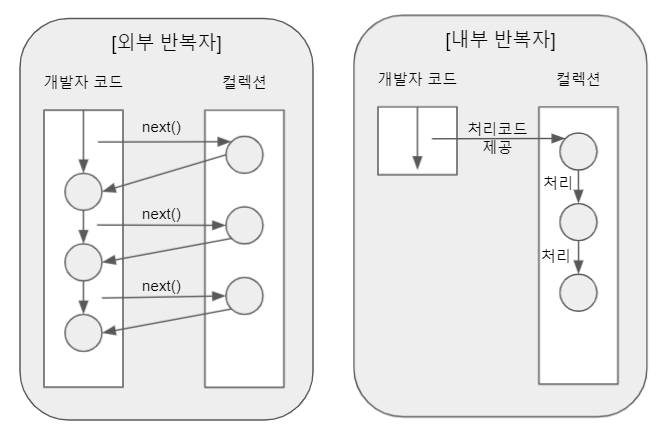
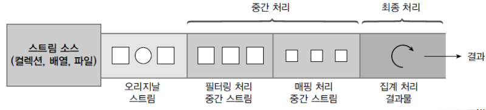
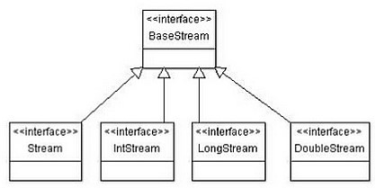
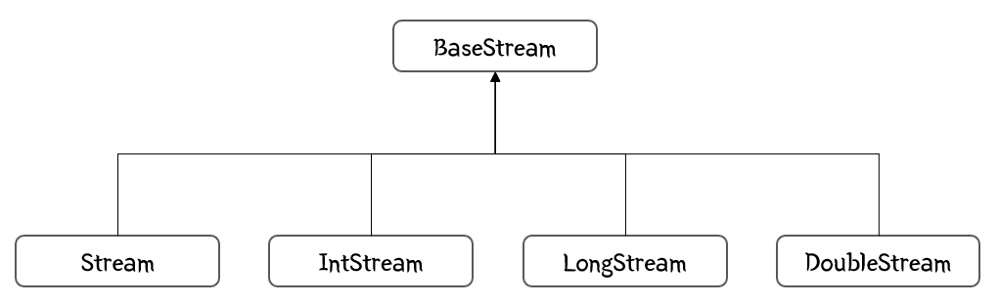
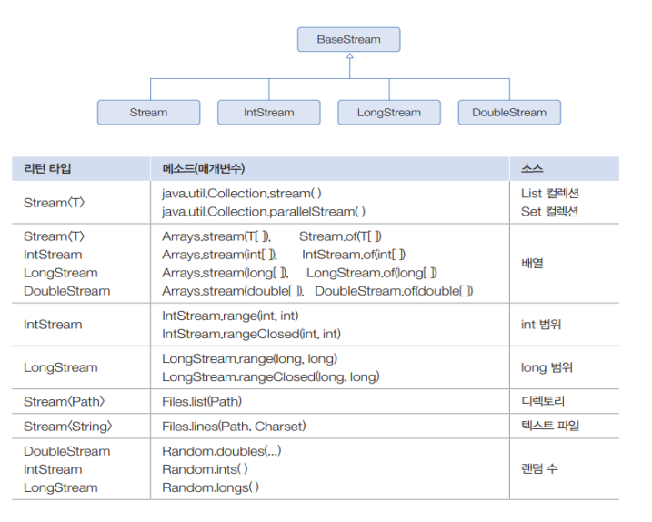
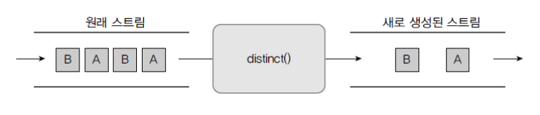
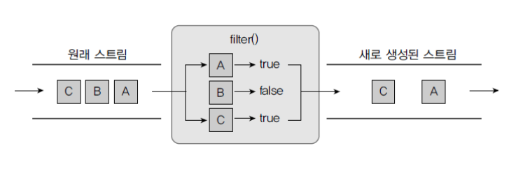
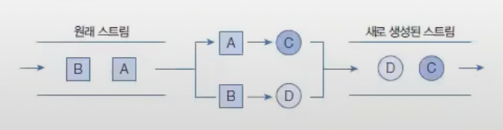
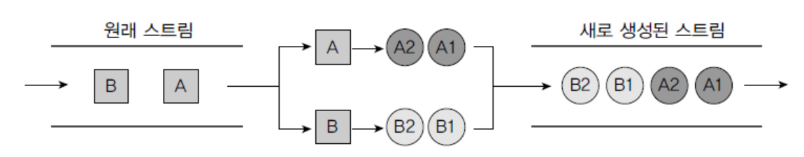

# 스트림
List 컬렉션에서 본복처리를 위해 for믄, Set 에서 요호를 하나씩 처리하기 위해 Interator 를 사용했는데
Java89부터 또다른 반복으로 Stream을 쓸 수 있다.
스트림은 요소들이 하나씩 흘러가면서 처리된다는 의미를 가지고 있다.
List 컬렉션에서 요소를 반복처리하기 위해 스트림을 ㅅ사용하면 stream()메소드로 Stream 객체를 얻고 forEach()메소드로 요소를 어떻게 처리할질르 람다식으로 제공하낟.
Set으로 사용할 때의 예제를 보자.

```Java
import java.util.HashSet;

public class SetStream {
    public static void main(String[] args) {
        Set<String> set = new HashSet<>();
        set.add("손흥민");
        set.add("이강인");
        set.add("구차절");
    
        Stream<String> stream = set.stream();
        stream.forEach(name -> System.out.println(name))
    }
}


[결과] 
구자철
이강인
손흥민
```


## Iterator VS  Stream
stream
1. 내부 반복자이므로 처리속도가 빠르고 병렬 처리에 효율적이다.
2. 람다식으로 다양한 요소 처리를 정의할 수 있다.
3. 중간 처리와 최종 처리를 수행하도록 파이프라인을 형성할 수 있다.


## 내부 반복자
for, Iterator는 컬렉션의 요소를 컬렉션 바깥쪽으로 반복햇거 가져와 처리하는데 이것을 외부 반복자라 한다.
컬렉션 요소를 외부로 가져오는 코드와 처리하는 코드를 모두 개발자 코드가 가지고 있어야한다.

<br>
스트림은 요소 처리 방법을 컬렉션 내부로 주입시켜서 요소를 반복처리하는데 이것을 내부 반복자라고 한다.
게빌자 코드에서 제공한 데이터 처리 코드(람다식)를 가지고 컬렉션 내부에서 요소를 반복처리한다.
멀티코어 CPU 를 최대한 활용하기 위해 요소들을 분배시켜 병렬 작업할 수 있다. 하나씩 처리하는 순차적 외부반복자보다는 효율적으로 요소를 반복시킬 수 있는 장점이 잇따.



List컬렉션의 내부반복자를 이용해 병렬처리하는 방법르 보여준다. parallelStream()메소드로 병렬 처리 스트림을 얻고 forEach()메소드를 호출할때 요소 처리 방법인 람다식을 제공한다.
람다식은 처리되는 요소가 무엇이고 어떤 스레드가 처리하는지를 출력한다.<br>

```Java
import java.util.Arrays;

public class ParallelStream {
    public static void main(String[] args) {
        List<String> list = Arrays.asList("이청용", "기성용", "손연재", "손흥민", "이강인");
        Stream<String> parallelStream = list.parallelStream();
        parallelStream, forEach(name -> System.out.println("name = " + Thread.currentThread().getName()));
    }
}
```
## 중간 처리와 최종 처리
스트림은 하나 이상 연결될 수 있다. 오리지널 스트림 뒤에 필터링 중간 스트림이 연결될 수 있고, 그 뒤에 매핑 중간 스트림이 연결될 수 있다.
스트림이 연결되어 있는 것을 스트림 파이프라인(Stream PipeLine)이라 한다.


최종처리를 위해 요소를 걸러내거나(필터링), 요소를 변환시키거나(매핑), 정렬하는 작업을 수행한다.
최종 처리는 중간 처리에서 정제된 요소들을 반복하거나 집계(카운팅, 총합, 평균) 작업을 수행한다.
코드로 수행하면,
```Java
Stream<Student> studentStream = list.stream();
IntStream scoreStream  = studentStream.mapToInt(student -> student.getScore());
double avg  = scoreStream.average().getAsDouble();
```
mapToInt()메소드는 객체를 int 값으로 매핑해서 IntStream으로 변환시킨다.
어떤 객체를 어떤 int 값으로 매핑할 것인지는 람다식으로 제공핵야한다.
student -> student.getScore() 는   Student 개개체를 getScore()의 리턴값으로 매핑한다.
IntStream 은 최종 처리를 위해 다양한 메소드를 제공하는데 average()메소드는 요소들의 평균값을 계산한다.


메소드 체이닝 패턴을 이용하면 아ㅠ의 코드를 더 간결하게 작성할 수 잇다.
```Java
double avg = list.stream().mapToInt(student-> student.getScore()).average().getAsDouble();
```
스트림 파이프라인으로 구성할 때 주의점은 파이프라이느이 맨 끝에는 반드시 최종 처리 부분이 있어야한다는 것이다.
최종 처리가 없다면 오리지널 및 중간처리 스트림은 동작하지 않는다. 즉 위 코드에서 average()이하를 생략하면 stream(), mapToInt()는 동작하지 않는다.

## 리소스로부터 스트림 얻기



BaseStream에는 모든 스트림에서 사용할 수 있는 공통 메소드들이 정의되어 있다.
Stream은 객체요소를 처리하는 스트림이고 IntStream, LongStream, DoubleStream은 각각 기본타입인  int, long, double 요소를 처리하는 스트림이다.
구현 객체는 다양한 리소스로부터 얻을 수 있다 . 주로 컬렉션과 배열에서 얻지만 다음과 같은 리소스로부터 스트림 구현 객체를 얻을 수 있다.


### 컬렉션으로부터 스트림 얻기

### 배열로부터 스트림 얻기

### 숫자 범위로부터 스트림 얻기

### 파일로부터 스트림 얻기

## 요소 걸러내기(필터링)
필터링은 요소를 걸러내는 중간 처리 기능이다. 필터링 메소드에서는 다음과 같이 distinct()와 filter()가 있다.
distinct() 메소드는 요소를 중복 제거한다. 객체 스트림일 경우, equals()메소드의 리턴값이 true면 동일한 요소로판단한다.
IntStream, LongStream, DoubleStream은 같은 값일 경우 중복을 제거한다.<br>
<br>
filter() 메소드는 매개값으로 주어진 Predicate가 true를 리턴하는 요소만 필터링 한ㄷ.

Predicate 는 함수형 인터페이스로 여러 종류가 있다.

## 요소 변환(매핑)
### 요소를 다른 요소로 변환 : mapXxx()




### 요소를 복수 개의 요소로 변환 : flatMapXxx() 


## 요소 정렬 : sorted()
### Comparable 구현 객체의 정렬
